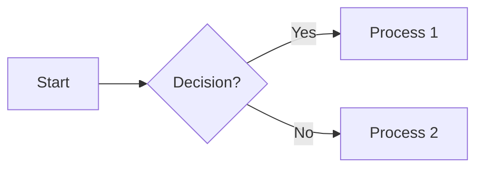
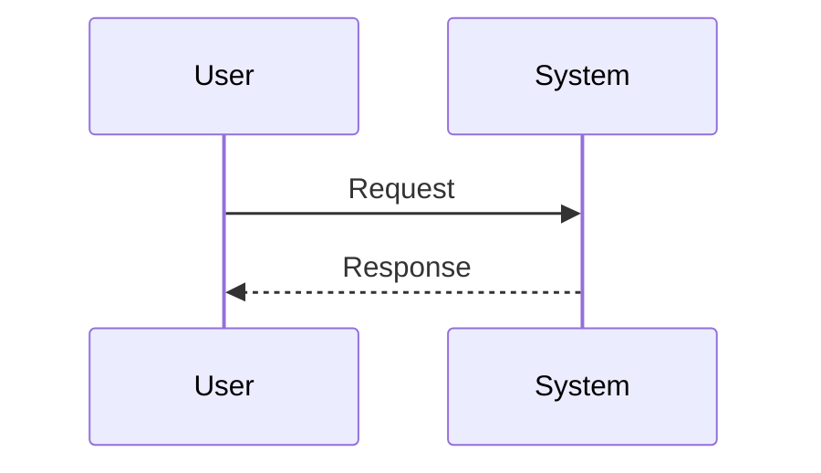
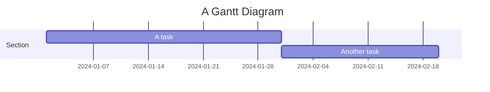
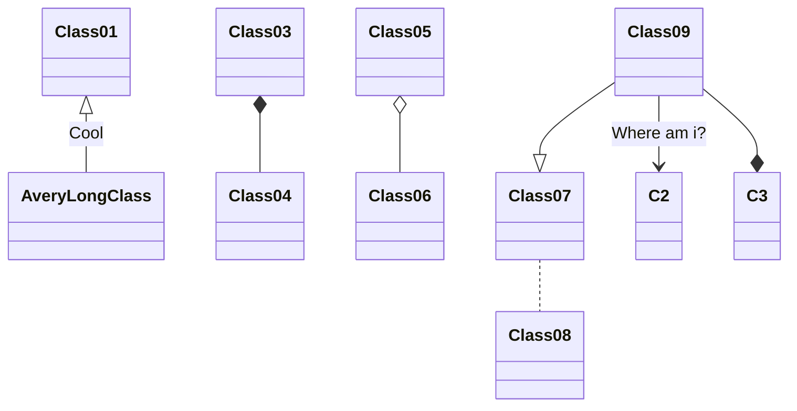
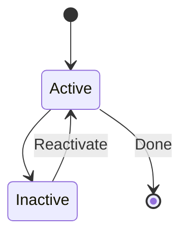
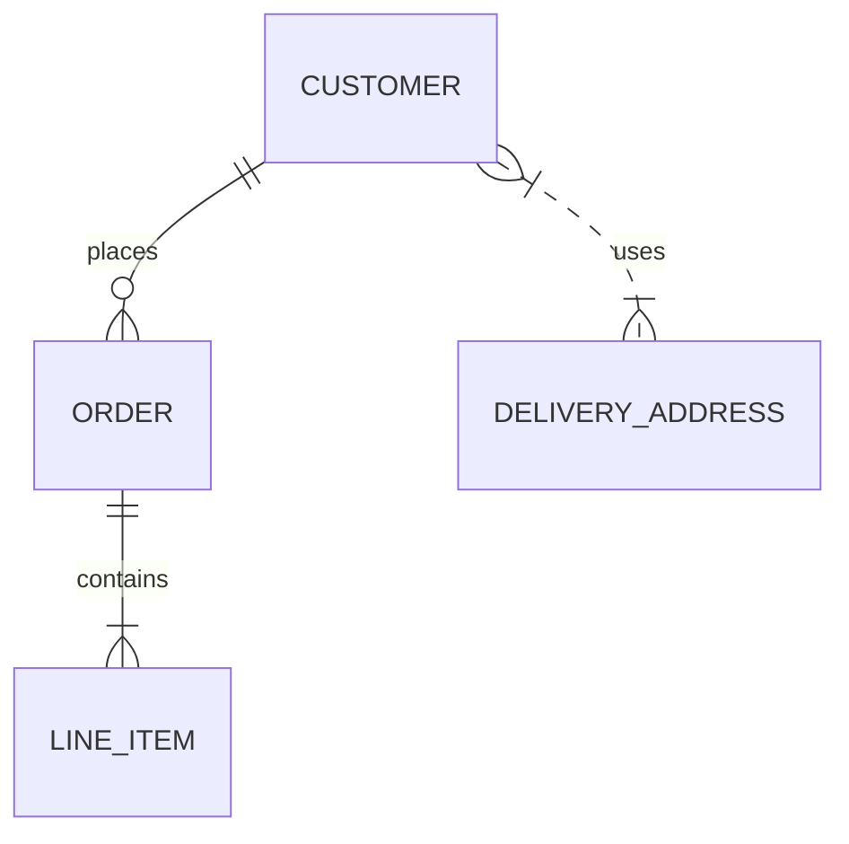
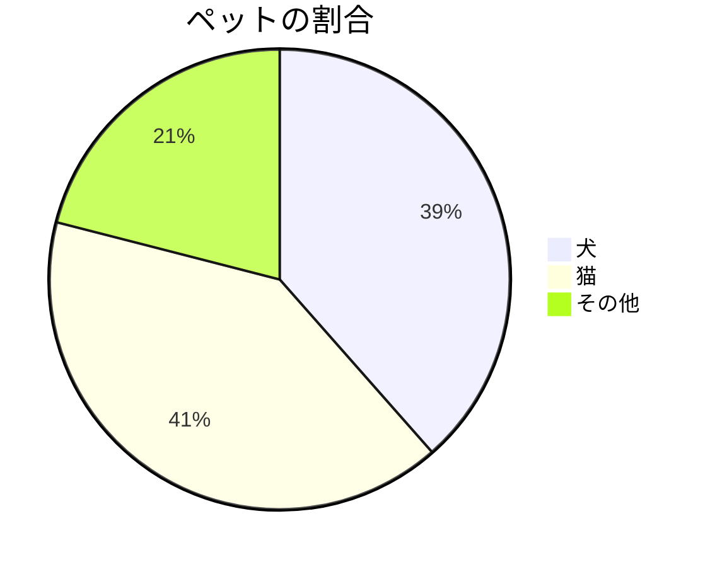

---
description:
  利用できるのマークダウンの構文とカスタム構文のサンプル集です。
  追加のプラグインやHandlebar.jsで拡張した構文もふくめて、全ての構文を確認するためのサンプルになります。
color:
  primary:
    "500": "var(--tw-blue-500)"
    "400": "var(--tw-blue-400)"
    "200": "var(--tw-blue-200)"
    "50": "var(--tw-blue-50)"
columns: false
---
# 使える構文のサンプル集

H1ヘッダーの次の行はサブタイトルを記述します。

2行目から本文になります。

## Headers

通常のマークダウンと同様に、`#`はH1、`##`はH2、`###`はH3、`####`はH4、`#####`はH5になります。

H1は自動的にタイトルとして扱われるので、必ず文書の先頭に1つだけ書くようにしてください。

## Code Block 

React のコンポーネントは `.tsx` ファイルに記述します。

```css
.foo {
  @apply bg-yellow-500 px-4;
  color: red; /* [!code --] */
  margin: 10% 12% 10% 8%; /* [!code ++] */
}
```

## Code Block with Title

タイトルはHTMLコメントで指定します。

<!-- title: Hello のみハイライト -->
```js /Hello/
console.log('Hello world'); // [!code highlight]
```

## Code Block with Title and Highlight

タイトルに半角空白が無ければ、コードのメタ情報でも指定できます。

```html {3,6-7} title:Helloのみハイライト、行番号指定のハイライト、コメント指定の行ハイライト
<div class="foo"><!-- [!code word:Hello] -->
  <h1>Hello world</h1>
  <p>こんにちは世界</p>
  <p>こんにちは世界</p><!-- [!code error] -->
  <p>こんにちは世界</p><!-- [!code warning] -->
  <p>こんにちは世界</p>
  <p>こんにちは世界</p>
</div>
```

## Link

[Astro ドキュメント](https://docs.astro.build/) は外部リンクなので、別タブで開きます。

## Footnotes

この文章は footnotes <span class="footnote">https://www.w3.org/TR/css-gcpm-3/#footnotes</span>のテスト<span class="footnote">footnoteだよ！</span>です。

## Autolink literals

www.example.com, https://example.com, and contact@example.com.

## Footnote Link

Footnote [^1]

[^1]: Footnote Comment

## QRコードの埋め込み

URLを記述すると、そのQRコードを埋め込むことができます。

<!-- qrcode: https://example.com/ -->

## Strikethrough

~取り消し線~ or ~~取り消し線~~

## Table

<!-- title: テーブルのキャプション -->
| 自動 | 左揃え | 右揃え |  中央揃え  |
| - | :- | -: | :-: |
| 1 | 2  |  3 |  4  |
| 5 | 6  |  7 |  8  |

## Tasklist

* [ ] to do
* [x] done

## PlantUML

```plantuml PlantUMLのサンプル
class User {
  +String name
  +String email
}
class Role {
  +String name
}
User "1" -- "*" Role : has roles
```

## Mermaid

### フローチャート

<!-- title: フローチャートのサンプル -->


### シーケンス図

<!-- title: シーケンス図のサンプル -->


### ガントチャート

<!-- title: ガントチャートのサンプル -->


### クラス図

<!-- title: クラス図のサンプル -->


### 状態図

<!-- title: 状態図のサンプル -->


### ER図

<!-- title: ER図のサンプル -->


### パイチャート

<!-- title: パイチャートのサンプル -->


## Images

### width and height、className


### width only


### height only


### className only


## Chapref

{{chapref '99-1'}}

## Headref

{{headref '99-1' 'Code Block'}}

## imageref

{{imageref '99-1' 'alt-text'}}

## coderef

{{coderef '99-1' 'hello-のみハイライト'}}

## tableref

{{tableref '99-1' 'テーブルのキャプション'}}

## Appendix Tag

{{appendix filePath 'hogehoge' 'Hoge Hoge'}}

（with hidden → Fuga Fuga）{{appendix-hidden filePath 'fugafuga' 'Fuga Fuga'}}

## Chat Area

### Chat Left

{{chat
  (chat-left '（Leftメッセージ）' 'キャラ名L' 'balloon-indigo-200' 'chat-left-icon.png')
}}

### Chat Right

{{chat
  (chat-right '（Rightメッセージ）' 'キャラ名R' 'balloon-fuchsia-200' 'chat-right-icon.png')
}}

### ALL

{{chat
  (chat-header 'チャットのタイトル')
  (chat-left '（Leftメッセージ）' 'キャラ名L' 'balloon-indigo-200' 'chat-left-icon.png')
  (repeat-chat-left '（Left連続メッセージ1）' 'balloon-indigo-200')
  (repeat-chat-left '（Left連続メッセージ2）' 'balloon-indigo-200')
  (chat-left '（Leftメッセージ）' 'キャラ名L' 'balloon-indigo-200' 'chat-left-icon.png')
  (repeat-chat-left '（Left連続メッセージ1）' 'balloon-indigo-200')
  (chat-right '（Rightメッセージ）' 'キャラ名R' 'balloon-fuchsia-200' 'chat-right-icon.png')
  (repeat-chat-right '（Right連続メッセージ1）' 'balloon-fuchsia-200')
}}

## Footnote

ググるというのはGoogle{{footnote 'https://google.co.jp'}}で検索することです。

### Footnote Inline

ググるというのはGoogle{{footnote-inline 'https://google.co.jp'}}で検索することです。

## Page Break

Page Breakは改ページです。

\{{page-break}}

ここから必ず次のページになります。`page-break`以外にも`left-break`、`right-break`があります。
